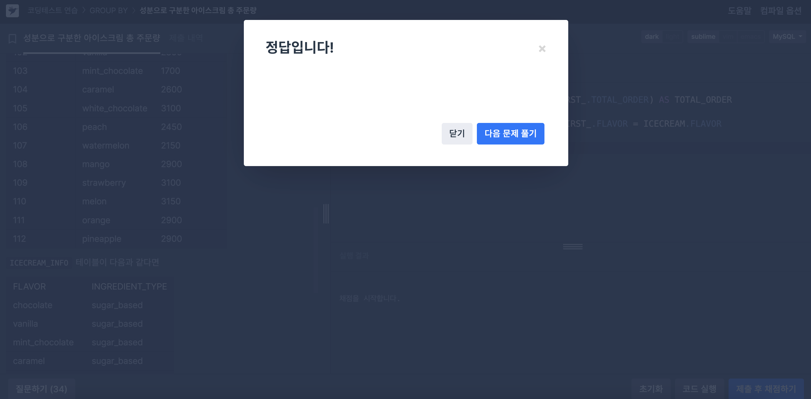
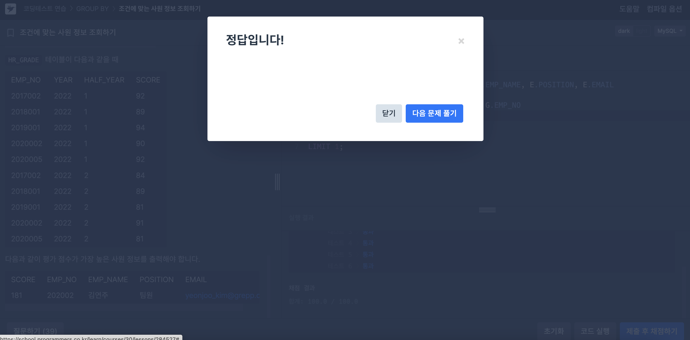

# SQL 문제풀이

## 성분으로 구분한 아이스크림 총 주문량



### 코드

```SQL
SELECT ICECREAM.INGREDIENT_TYPE, SUM(FIRST_.TOTAL_ORDER) AS TOTAL_ORDER
    FROM FIRST_HALF AS FIRST_
    JOIN ICECREAM_INFO AS ICECREAM ON FIRST_.FLAVOR = ICECREAM.FLAVOR
    GROUP BY ICECREAM.INGREDIENT_TYPE
    ORDER BY TOTAL_ORDER ASC;
```

- 그냥 `GROUP BY`를 잘 했다면, 쉽게 풀리는 문제였다.

## 즐겨찾기가 가장 많은 식당 정보 출력하기


### 코드

```SQL
SELECT FOOD_TYPE, REST_ID, REST_NAME, FAVORITES
    FROM REST_INFO
    WHERE (FOOD_TYPE, FAVORITES)
    IN
    (SELECT FOOD_TYPE, MAX(FAVORITES)
        FROM REST_INFO
        GROUP BY FOOD_TYPE )
    ORDER BY FOOD_TYPE DESC;
```

- 만약 서브쿼리를 사용하지 않고, 각 FOOD_TYPE별로 그룹화하여 MAX(FAVORITES) 값을 구하면 REST_ID와 REST_NAME이 무작위로 MAX(FAVORITES)와 연결될 수 있다. GROUP BY에 포함되지 않은 열을 선택하려면 그 열이 집계 함수나 GROUP BY에 포함되어야 하기 때문이다. 아니면 결과가 에러 또는 예측 불가능해짐!

## 조건에 맞는 사원 정보 조회하기



### 코드

```SQL
SELECT SUM(SCORE) AS SCORE, G.EMP_NO, E.EMP_NAME, E.POSITION, E.EMAIL
FROM HR_EMPLOYEES E
    INNER JOIN HR_GRADE G ON E.EMP_NO = G.EMP_NO
GROUP BY YEAR, EMP_NO
HAVING G.YEAR = '2022'
ORDER BY 1 DESC
LIMIT 1;
```

- 우선 HR_DEPARTMENT 테이블은 사용하지 않았다.
- 2022년이어야 하므로 혹시 모를 결합 오류에 대비해 `GROUP BY`를 `YEAR`와 `EMP_NO`두 개에 대해 진행한다.
- 마지막으로 하나만 출력하므로 `LIMIT 1`!!
