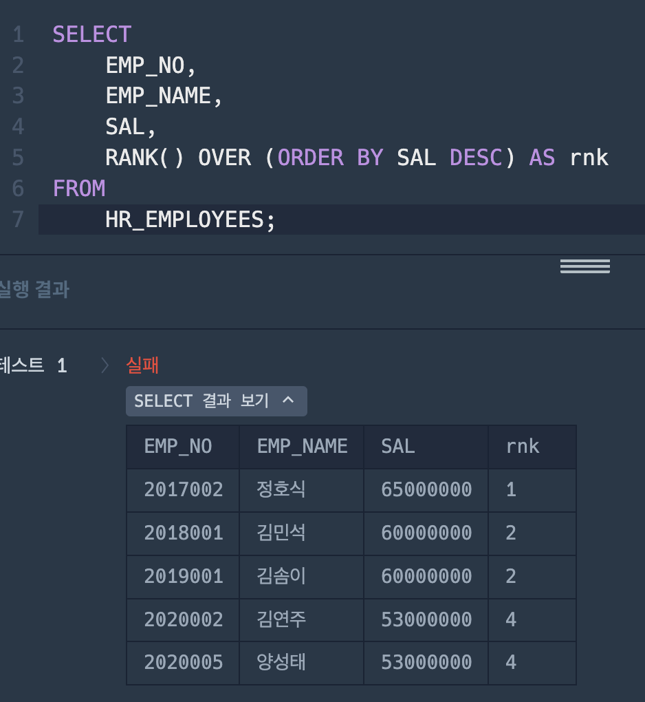
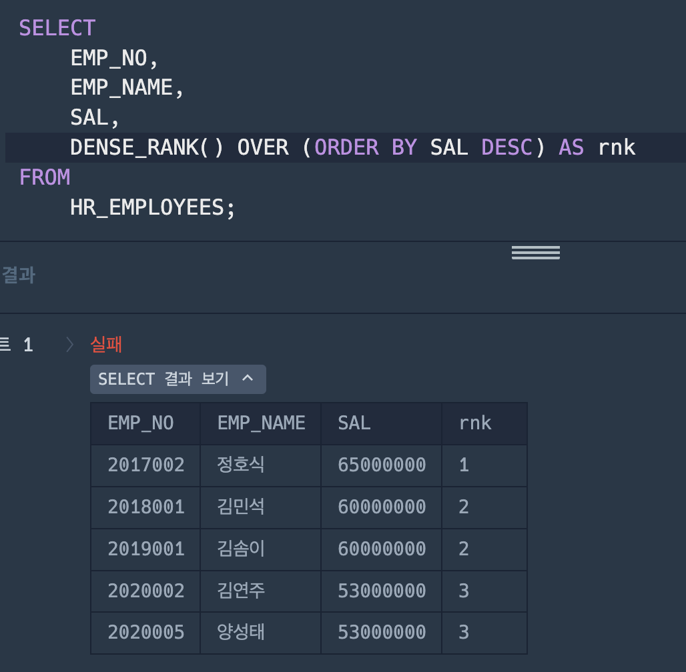
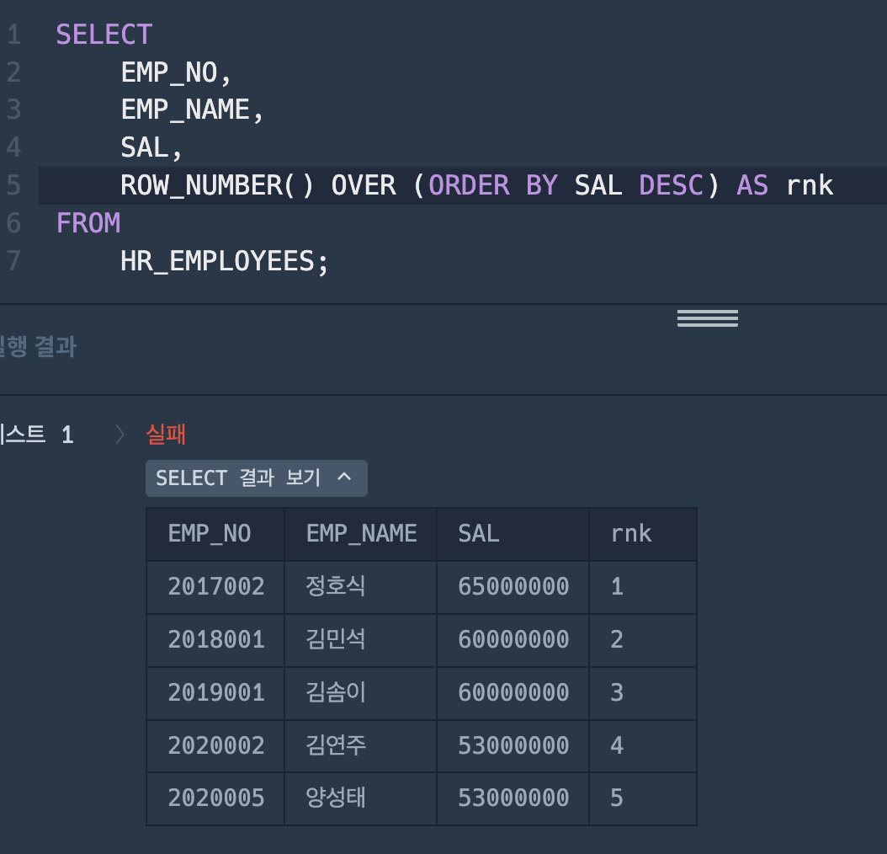

## 즐겨찾기가 가장 많은 식당 정보 출력하기

### 틀린 코드

```SQL
SELECT *
FROM (SELECT FOOD_TYPE, REST_ID, REST_NAME, MAX(FAVORITES) AS FAVORITES
FROM REST_INFO
GROUP BY FOOD_TYPE
ORDER BY FOOD_TYPE DESC
```

### 정답 코드

```SQL
SELECT FOOD_TYPE, REST_ID, REST_NAME, FAVORITES
    FROM REST_INFO
    WHERE (FOOD_TYPE, FAVORITES)
    IN
    (SELECT FOOD_TYPE, MAX(FAVORITES)
        FROM REST_INFO
        GROUP BY FOOD_TYPE )
    ORDER BY FOOD_TYPE DESC;
```

첫 번째 코드가 틀린 이유는 GROUP BY 절에서 FOOD_TYPE으로 그룹화하면서 SELECT 절에 REST_ID와 REST_NAME을 포함시켰기 때문임. SQL에서 GROUP BY를 사용할 때, SELECT 절에는 그룹화된 컬럼이나 집계 함수(MAX(FAVORITES) 등)를 사용한 컬럼만 포함할 수 있음. REST_ID와 REST_NAME은 GROUP BY에 포함되지 않았고 집계 함수도 적용되지 않았으므로 SQL 문법에 맞지 않음.

반면에 두 번째 코드는 서브쿼리를 사용하여 각 FOOD_TYPE별 FAVORITES의 최대값을 구하고, 그 결과를 이용해 원본 테이블에서 해당하는 행을 선택하고 있음. 이 방식으로 REST_ID와 REST_NAME을 포함한 정확한 데이터를 추출할 수 있음.

### 개선된 쿼리

```SQL
WITH RankedRest AS (
    SELECT
        FOOD_TYPE, REST_ID, REST_NAME, FAVORITES,
        ROW_NUMBER() OVER (PARTITION BY FOOD_TYPE ORDER BY FAVORITES DESC, REST_ID) AS rnk
    FROM REST_INFO
)
SELECT
    FOOD_TYPE, REST_ID, REST_NAME, FAVORITES
FROM RankedRest
WHERE rnk = 1
ORDER BY FOOD_TYPE DESC;
```

1. WITH 절을 사용하여 RankedRest라는 임시 테이블을 생성하고 있음:
   WITH RankedRest AS (...)는 서브쿼리의 결과를 RankedRest라는 이름의 임시 테이블로 저장함.

2. SELECT 절에서 각 레스토랑에 랭킹을 부여하고 있음:
   ROW_NUMBER() OVER (...) AS rnk를 사용하여 각 행에 랭킹 번호를 매김.
   PARTITION BY FOOD_TYPE로 FOOD_TYPE별로 데이터를 분할함.
   ORDER BY FAVORITES DESC, REST_ID로 FAVORITES를 기준으로 내림차순 정렬하고, 동률인 경우 REST_ID로 추가 정렬함.
   결과적으로 각 FOOD_TYPE 내에서 FAVORITES가 가장 높은 레스토랑에 rnk 값이 1로 부여됨.

3. FROM 절에서 REST_INFO 테이블의 데이터를 가져오고 있음:
   원본 테이블인 REST_INFO에서 필요한 컬럼들을 선택함.

4. 메인 쿼리에서 랭킹이 1인 레스토랑만 선택하고 있음:
   WHERE rnk = 1을 사용하여 각 FOOD_TYPE별로 FAVORITES가 가장 높은 레스토랑만 필터링함.

5. 결과를 FOOD_TYPE 기준으로 내림차순 정렬하고 있음:
   ORDER BY FOOD_TYPE DESC로 최종 결과를 FOOD_TYPE의 역순으로 정렬함.

**[ 장점 ]**

1. 코드의 가독성이 좋아짐
2. 추가적인 랭킹 기준을 쉽게 적용가능해짐.

## 조건에 맞는 사원 정보 조회하기

### RANK()



### DENSE_RANK()



### ROW_NUMBER()



<br>

**RANK() 함수**

동일한 값에 동일한 순위를 부여하고, 그로 인해 순위 사이에 격차가 발생하는 경우에 사용함.<br>
-> 대회에서 동점자가 있을 때, 공동 2위가 두 명이면 다음 순위는 4위가 됨.

**DENSE_RANK() 함수**

동일한 값에 동일한 순위를 부여하되, 순위 번호를 연속적으로 유지하고 싶을 때 사용함.<br>
-> 성적 순위 부여 시, 동일한 점수의 학생들에게 동일한 순위를 주고 다음 순위는 바로 다음 번호를 사용함.

**ROW_NUMBER() 함수**

각 행에 고유한 순번을 부여할 때 사용함.<br>
-> 검색 결과를 페이지별로 나눌 때 각 행에 연속적인 번호를 부여함.
