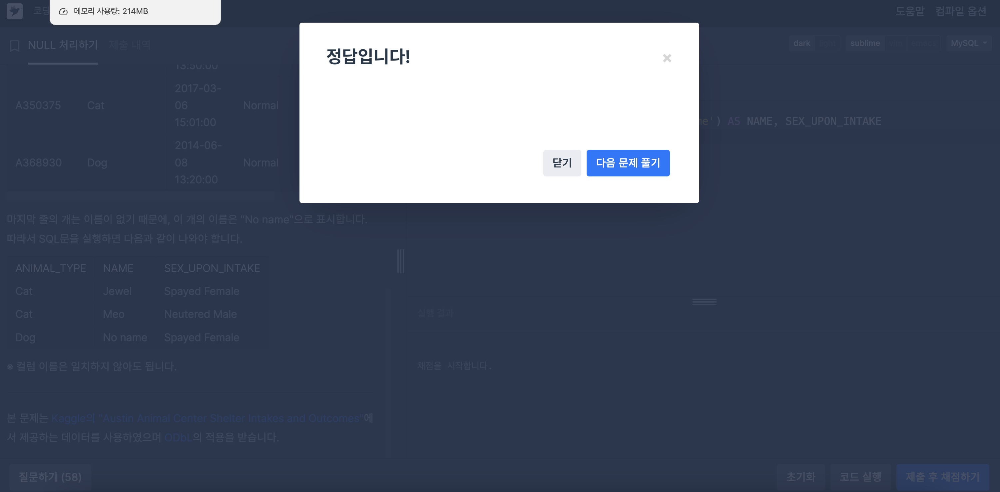
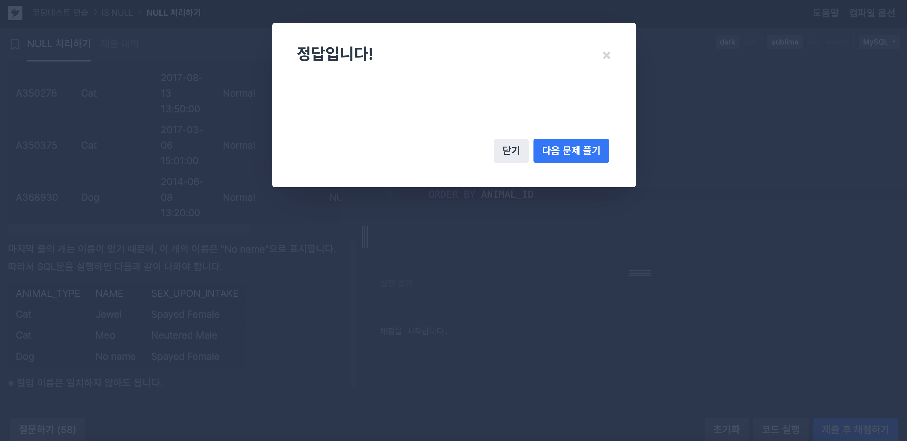
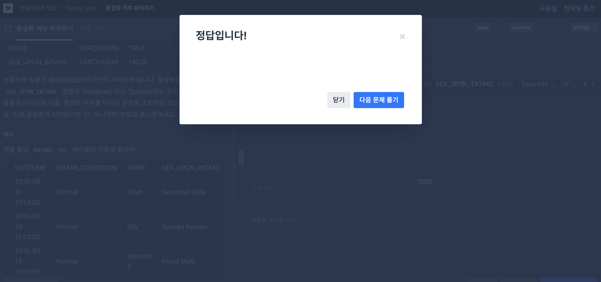

# SQL 문제풀이

## NULL 처리하기



### 문제 1. IFNULL 코드

```SQL
SELECT ANIMAL_TYPE, IFNULL(NAME, 'No name') AS NAME, SEX_UPON_INTAKE
    FROM ANIMAL_INS
    ORDER BY ANIMAL_ID
```

- MySQL에서는 `ISNULL` 대신 `IFNULL`을 사용한다.

### 문제 2. CASE WHEN 코드



```SQL
SELECT ANIMAL_TYPE,
    (CASE
        WHEN NAME IS NULL THEN 'No name'
        WHEN NAME IS NOT NULL THEN NAME
    END) AS NAME, SEX_UPON_INTAKE
    FROM ANIMAL_INS
    ORDER BY ANIMAL_ID
```

## 중성화 여부 파악하기



### 문제 3. 코드

```SQL
SELECT ANIMAL_ID, NAME,
    IF(SEX_UPON_INTAKE LIKE 'Neutered%' OR SEX_UPON_INTAKE LIKE 'Spayed%', 'O', 'X') AS '중성화'
    FROM ANIMAL_INS
    ORDER BY ANIMAL_ID
```

- `IF문`에서 `LIKE`를 사용하는 방법을 잘 알 수 있었다.

### 문제 4. QnA 질문 해결해주기

[QnA\_링크](https://school.programmers.co.kr/questions/80270)

### 틀린 코드

```SQL
SELECT animal_id, name,
       if (sex_upon_intake like '%Neutered%' or '%Spayed%', 'O' , 'X') as '중성화'
from animal_ins
order by 1
```

- 위 코드의 경우 OR 뒤에 나오는 '%Spayed%'는 조건으로 해석되지 않고 문자열로 처리된다. 때문에 SQL은 이를 항상 참으로 간주한다.
- 올바른 쿼리는, 각 조건을 LIKE와 함께 반복적으로 작성해야 한다. 즉 `IF(SEX_UPON_INTAKE LIKE 'Neutered%' OR SEX_UPON_INTAKE LIKE 'Spayed%', 'O', 'X')` 이런식으로 반복해서 작성해야 한다는 뜻이다.
