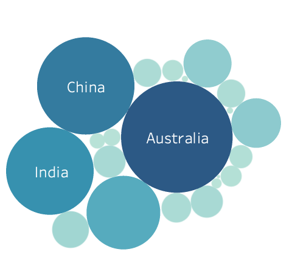
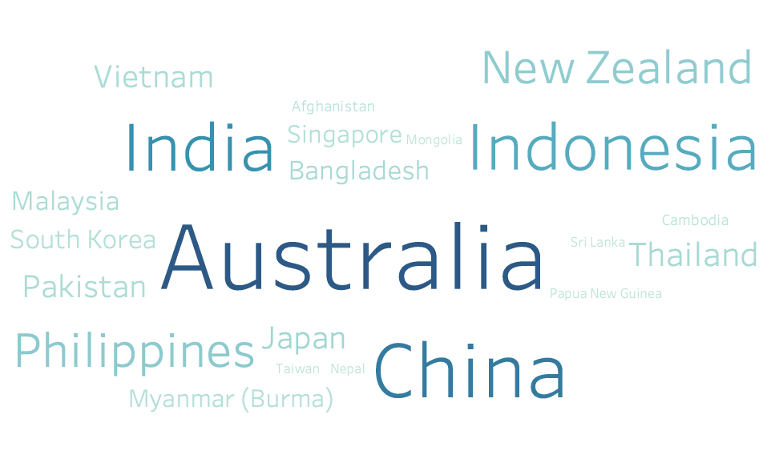
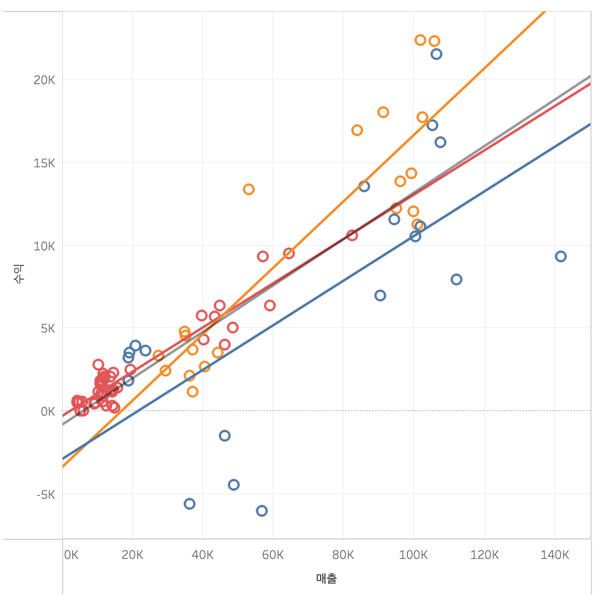
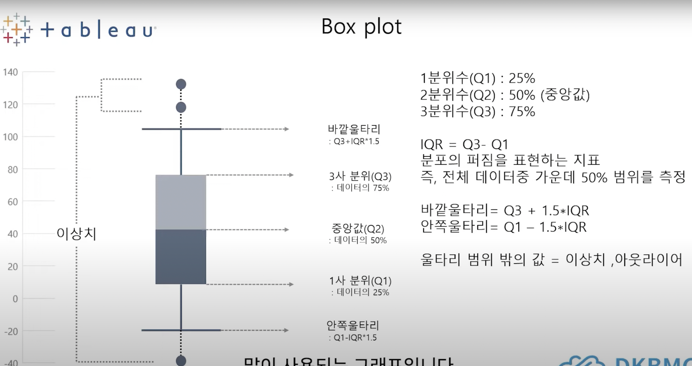
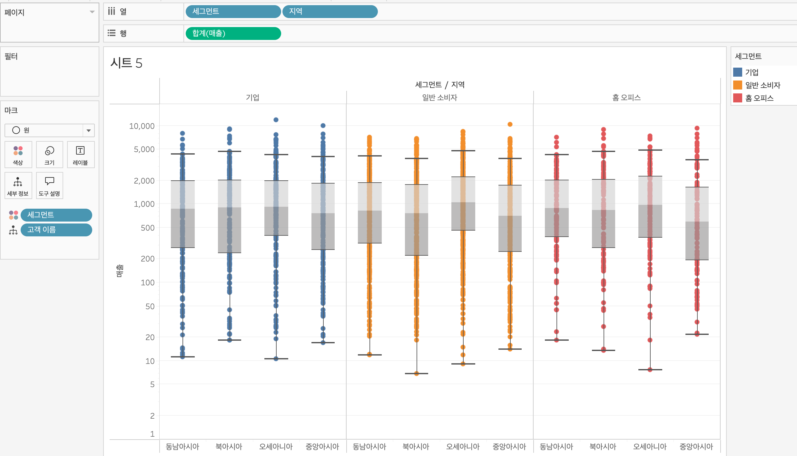
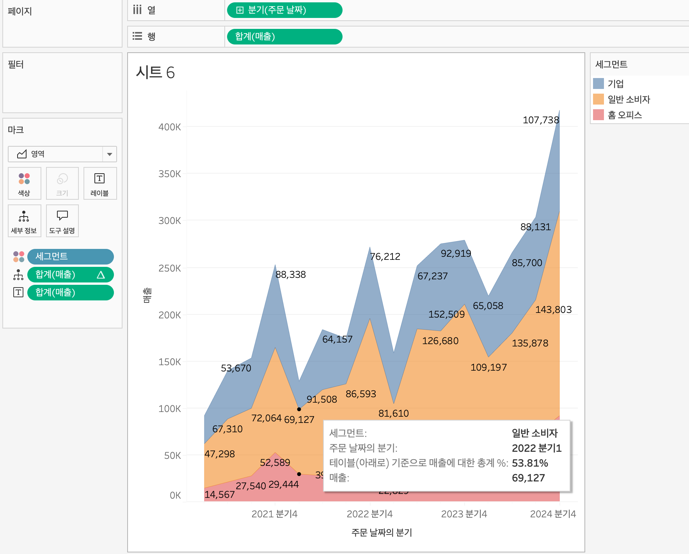
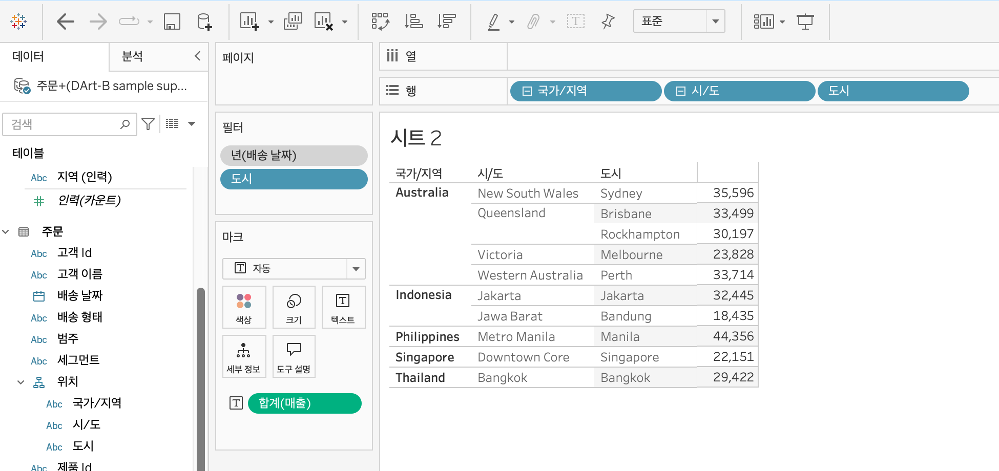
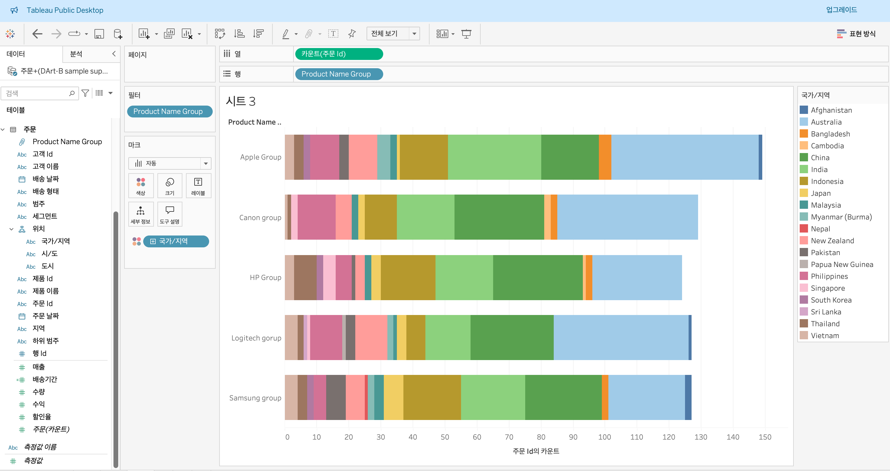

# Third Study Week

- 20강: [파이와 도넛차트](#20강-파이와-도넛차트)

- 21강: [워드와 버블차트](#21강-워드와-버블차트)

- 22강: [이중축과 결합축](#22강-이중축과-결합축)

- 23강: [분산형 차트](#23강-분산형-차트)

- 24강: [히스토그램](#24강-히스토그램)

- 25강: [박스플롯](#25강-박스플롯)

- 26강: [영역차트](#26강-영역차트)

- 27강: [간트차트](#27강-간트차트)

- 28강: [필터](#28강-필터)

- 29강: [그룹](#29강-그룹)

- 문제1 : [문제1](#문제1)

- 문제2 : [문제2](#문제2)

- 참고자료 : [참고자료](#참고-자료)

## Study Schedule

| 강의 범위 | 강의 이수 여부 | 링크                                                                                                 |
| --------- | -------------- | ---------------------------------------------------------------------------------------------------- |
| 1~9강     | ✅             | [링크](https://youtu.be/3ovkUe-TP1w?si=CRjj99Qm300unSWt)                                             |
| 10~19강   | ✅             | [링크](https://www.youtube.com/watch?v=AXkaUrJs-Ko&list=PL87tgIIryGsa5vdz6MsaOEF8PK-YqK3fz&index=75) |
| 20~29강   | ✅             | [링크](https://www.youtube.com/watch?v=Qcl4l6p-gHM)                                                  |
| 30~39강   | 🍽️             | [링크](https://www.youtube.com/watch?v=e6J0Ljd6h44&list=PL87tgIIryGsa5vdz6MsaOEF8PK-YqK3fz&index=55) |
| 40~49강   | 🍽️             | [링크](https://www.youtube.com/watch?v=AXkaUrJs-Ko&list=PL87tgIIryGsa5vdz6MsaOEF8PK-YqK3fz&index=45) |
| 50~59강   | 🍽️             | [링크](https://www.youtube.com/watch?v=AXkaUrJs-Ko&list=PL87tgIIryGsa5vdz6MsaOEF8PK-YqK3fz&index=35) |
| 60~69강   | 🍽️             | [링크](https://www.youtube.com/watch?v=AXkaUrJs-Ko&list=PL87tgIIryGsa5vdz6MsaOEF8PK-YqK3fz&index=25) |
| 70~79강   | 🍽️             | [링크](https://www.youtube.com/watch?v=AXkaUrJs-Ko&list=PL87tgIIryGsa5vdz6MsaOEF8PK-YqK3fz&index=15) |
| 80~89강   | 🍽️             | [링크](https://www.youtube.com/watch?v=AXkaUrJs-Ko&list=PL87tgIIryGsa5vdz6MsaOEF8PK-YqK3fz&index=5)  |

<!-- 여기까진 그대로 둬 주세요-->
<!-- 이 안에 들어오는 텍스트는 주석입니다. -->

# Third Study Week

## 20강: 파이와 도넛차트

<!-- 파이와 도넛차트에 관해 배우게 된 점을 적어주세요 -->

> **🧞‍♀️ 도넛차트를 생성하는 법을 기록해주세요.**

```
1. 파이차트로 차트형식 변경
2. avg(0) 두개 생성
3. 두번째 avg(0) 이중 축 클릭!
4. 색상에서 태두리도 0으로 하면 좋다.

+ (레이블 -> 퀵 테이블계산 -> 구성비율) 로 하면 비율로 나타난다.
```

## 21강: 워드와 버블차트

<!-- 워드와 버블차트에 관해 배우게 된 점을 적어주세요 -->



```
버블차트 : 수치적 데이터를 원의 크기로 표현하는 차트이다.

<방법>

1. 국가/지역과 매출을 command로 묶은 후 표현방식에서 버블 차트 클릭
2. 매출 색상에 넣기


워드클라우드 : 한 텍스트가 얼마나 자주 등장하는지 텍스트 크기로 표현하는 차트

<방법>

1. 국가/지역 (지리적데이터)를 카운트로 계산된 필드 만들기
2. 국가/지역 텍스트에 넣기
3. 매출 색상에 넣기
4. 마크 유형을 텍스트로 변경하기

```

## 22강: 이중축과 결합축

<!-- 이중축과 결합축에 관해 배우게 된 점을 적어주세요 -->
<h3>이중축</h3>

```
1. 주문 날짜 연속형 분기로 놓기
2. 매출 수익 더블 클릭
3. 수익 우클릭 이중축
4. 축에서 축 동기화 클릭

```

<h3>결합된 축</h3>

```
결합된 축은 측정값 중 가장 큰 값과 연결된다.

연결할 때 기존 그래프의 왼쪽 축에 초록색 박스가 두개 생성되는 표시가 뜨도록 연결한다.
```

## 23강: 분산형 차트

<!-- 분산형 차트에 관해 배우게 된 점을 적어주세요 -->

```js
강의 영상과 달리, 우리 파일에는 '제조 업체' 필드가 없습니다. 필요한 경우, 계산된 필드를 이용해 'SPLIT([제품 이름], ' ', 1)'를 '제조 업체'로 정의하시고 세부 정보에 놓아주세요.
```



```
분산형 차트는 파라미터 간의 상관관계를 파악하는데 유용한 그래프이다.

1. 합계(매출) 열에, 합계(수익) 행에
2. 제조업체 세부정보, 범주 색상
3. 왼쪽 시트의 분석 -> 추세선 -> 차트에 끌고 선형에 놓기
4. 추세선 오른쪽 클릭 -> 모든 추세선 편집 -> 범주 클릭 해제 (전체 표시)

```

## 24강: 히스토그램

<!-- 히스토그램에 관해 배우게 된 점을 적어주세요 -->

```
히스토그램 : 불연속형이 아닌 연속형 측정값을 범위 혹은 구간 차원으로 그룹화한다는 점에서 차이가 있다.
-> 히스토그램은 차원 필드 없이 측정값만으로 그래프를 그릴 때, 주로 사용하는 표현 방식이다.

1. 구간차원 만들기
-> 매출 우클릭 -> 만들기 -> 구간차원 -> 구간차원크기 100
2. 매출(구간차원) 열에 옮기고 우클릭후 연속으로 만들기
3. 매출을 행으로! & 카운트 형식으로 바꾸기

1. 수익을 열 & 표현방식에서 히스토그램 -> 수익이 구간차원으로 변경됨(연속형)
2. 범주를 색상에
3. 값 차이가 극단적이다 -> 축에 마우스 우클릭 -> 축편집 -> 로그 활성화

```

## 25강: 박스플롯


<!-- 박스플롯에 관해 배우게 된 점을 적어주세요 -->

```
1. 세그먼트 지역 열, 매출 행
2. 표현방식 -> 박스플룻
3. 지역 다시 열로, 고객이름 색상
4. 축편집 -> 눈금 로그
```



## 26강: 영역차트

<!-- 영역차트에 관해 배우게 된 점을 적어주세요 -->


```
영역차트 : 라인과 축 사이의 공간이 색상으로 채워진 라인 차트이다.
-> 영역을 색상으로 채우는 차트이기에, 주로 연속형 데이터의 누계를 표현하는데 사용된다.

1. 주문날짜 분기로 열(연속형), 합계(매출) 행, 표현방식 영역차트
2. 세그먼트 색상, 매출 레이블
3. 매출 세부정보, 우클릭 -> 다음을 사용하여 계산 -> 아래로
4. 매출 퀵테이블계산 -> 구성비율

```

## 27강: 간트차트

<!-- 간트차트에 관해 배우게 된 점을 적어주세요 -->

간트차트 : 주로 시간 경과에 따른 기간을 시각화하는데 사용된다.<br>
<br>

`DATEDIFF('day', [주문 날짜], [배송날짜])` : 배송날짜에서 주문날짜를 뺀 값을 일 단위로 반환한다.

```
"제품 범주별 고객의 배송 기간을 제품형태로 구분한 간트차트 만들기"

1. 월(불연속형) 배송 날짜를 열에, 범주를 행에, 배송기간 필드를 크기에 & 평균으로 바꾸기
2. 마크를 간트차트로 변경
3. 고객이름을 필터에, 고객이름 필터 우클릭 -> 필터표시
4. 배송형태 색상에.
```

## 28강: 필터

<!-- 필터에 관해 배우게 된 점을 적어주세요 -->

Tableau 동작 순서 : 추출, 데이터원본, 컨텍스트, 차원, 측정값, 필터 순으로 동작

```
<추출필터>
연결 -> 추출 클릭 -> 편집필터 클릭 -> 추가 클릭 -> 주문 날짜 -> 년 -> 2021 선택 확인 -> 워크시트 클릭
: 서버나 데이터베이스에서 받아오던 데이터를 추출을 통해 일부만 따로 저장, 이 저장주소에 있는 로컬 데이터와만 연동해서 작업하겠다는 뜻
: 추출에서 데이터를 필터링하는 경우, 데이터를 가져올 때나 저장할 때 최우선으로 필터링이 저장된다.

<데이터원본필터>
우상단 필터 추가 -> 추가 -> 등등

<컨텍스트 필터>
: 필터 중 상위 필터라고 할 수 있다.
Tableau는 각 필터가 다른 필터에 관계없이 모든 행에 엑세스하도록 작동하는데
여러가지 필터를 설정했을 떄 컨텍스트 필터로 지정해주게 되면 다른 필터가 컨텍스트 필터에 종속되어 작동한다.
```

## 29강: 그룹

<!-- 그룹에 관해 배우게 된 점을 적어주세요 -->

```
데이터를 표시하는 방법 : 그룹, 계층, 집합 존재.

<그룹>
- 그룹을 이용해 수동으로 필드에 있는 항목 묶기 가능
- 기존 데이터 원본에 없는 사용자 지정 그룹 필드 만들기 가능

첫번째 방법 : 뷰에서 그룹을 만드는 방법.
1. 제품이름 열, 수익 행으로.
2. 그래프 전체 드래그 선택 -> 우클릭 그룹 선택
3. 왼쪽 데이터 패널에 새 필드가 추가됨.
4. 그룹을 만들면 자동으로 마크 카드에 제품이름 (그룹)이 추가된다.

두 번째 방법 : 항목별로 묶을 필드를 선택해 만드는 방법.
1. 제품이름 필드 위에 마우스 우클릭 만들기 -> 그룹
2. shift 누른채 전부 선택, 그룹
3. 기타포함 클릭 -> 나머지 회사 그룹화
4. 그룹 필드를 색상마크에 올리기
```

## 문제 1.

```js
유정이는 superstore 데이터셋에서 '주문' 테이블을 보고 있습니다.
1) 국가/지역 - 시/도- 도시 의 계층을 생성했습니다. 계층 이름은 '위치'로 설정하겠습니다.
2) 날짜의 데이터 타입을 '날짜'로 바꾸었습니다.

코로나 시기의 도시별 매출 top10을 확인하고자
1) 배송 날짜가 코로나시기인 2021년, 2022년에 해당하는 데이터를 필터링했고
2) 위치 계층을 행으로 설정해 펼쳐두었습니다.
이때, 매출의 합계가 TOP 10인 도시들만을 보았습니다.
```


```
겉보기에는 전체 10개로, 잘 나온 결과처럼 보입니다. 그러나 유정이는 치명적인 실수를 저질렀습니다.
오늘 배운 '컨텍스트 필터'의 내용을 고려하여 올바른 풀이 및 결과를 구해주세요.
```

<!-- DArt-B superstore가 아닌 개인 superstore 파일을 사용했다면 값이 다르게 표시될 수 있습니다.-->



```
2021년과 2022년의 데이터를 필터링하는게 우선되어야한다.
따라서 년(배송 날짜)필터를 컨텍스트 필터로 설정했다.
```

## 문제 2.

```js
태영이는 관심이 있는 제품사들이 있습니다. '제품 이름' 필드에서 '삼성'으로 시작하는 제품들을 'Samsung group'으로, 'Apple'으로 시작하는 제품들을 'Apple group'으로, 'Canon'으로 시작하는 제품들을 'Canon group'으로, 'HP'로 시작하는 제품들을 'HP group', 'Logitech'으로 시작하는 제품들을 'Logitech group'으로 그룹화해서 보려고 합니다. 나머지는 기타로 설정해주세요. 이 그룹화를 명명하는 필드는 'Product Name Group'으로 설정해주세요.

(이때, 드래그보다는 멤버 찾기 > 시작 문자 설정하여 모두 찾아 한번에 그룹화해 확인해보세요.)
```


```js
해당 그룹별로 어떤 국가/지역이 주문을 많이 차지하는지를 보고자 합니다. 매출액보다는 주문량을 보고 싶으므로, 주문Id의 카운트로 계산하겠습니다.

기타를 제외하고 지정한 5개의 그룹 하위 목들만을 이용해 아래와 같이 지역별 누적 막대그래프를 그려봐주세요.
```




```
시각화 완료했습니다!
```
