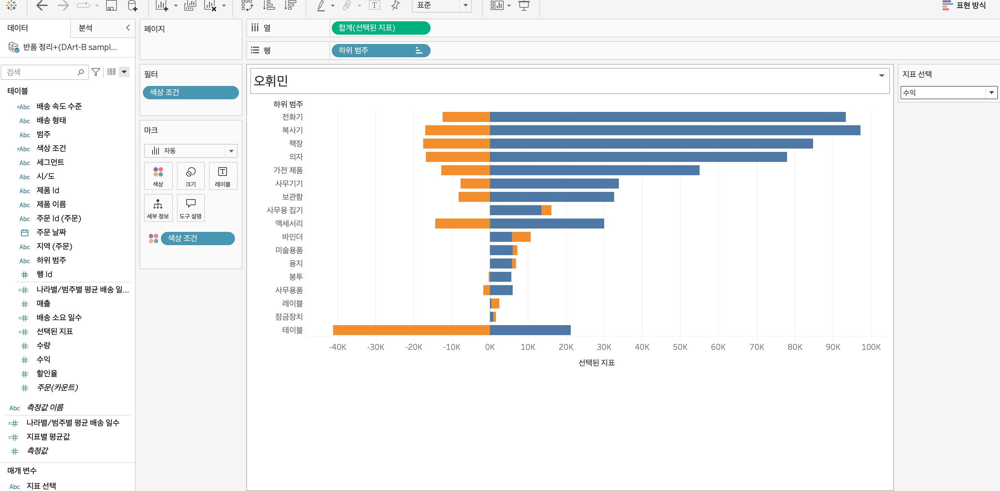

# Fifth Study Week

- 39강: [LOD](#39강-lod)

- 40강: [EXCLUDE](#40-lod-exclude)

- 41강: [INCLUDE](#41-lod-include)

- 42강 : [매개변수](#42-매개변수)

- 43강 : [매개변수 실습](#43-매개변수-실습)
  

- 44강: [매개변수 실습](#44-매개변수-실습)

- 45강: [마크카드](#45-워크시트-마크카드)

- 46강: [서식계층](#46-서식-계층)

- 47강: [워크시트](#47-워크시트-서식)

- [문제1](#문제-1)

- [문제2](#문제-2)

## Study Schedule

| 강의 범위 | 강의 이수 여부 | 링크                                                                                                 |
| --------- | -------------- | ---------------------------------------------------------------------------------------------------- |
| 1~9강     | ✅             | [링크](https://www.youtube.com/watch?v=AXkaUrJs-Ko&list=PL87tgIIryGsa5vdz6MsaOEF8PK-YqK3fz&index=84) |
| 10~19강   | ✅             | [링크](https://www.youtube.com/watch?v=AXkaUrJs-Ko&list=PL87tgIIryGsa5vdz6MsaOEF8PK-YqK3fz&index=75) |
| 20~29강   | ✅             | [링크](https://www.youtube.com/watch?v=AXkaUrJs-Ko&list=PL87tgIIryGsa5vdz6MsaOEF8PK-YqK3fz&index=65) |
| 30~38강   | ✅             | [링크](https://www.youtube.com/watch?v=e6J0Ljd6h44&list=PL87tgIIryGsa5vdz6MsaOEF8PK-YqK3fz&index=55) |
| 39~47강   | ✅             | [링크](https://www.youtube.com/watch?v=AXkaUrJs-Ko&list=PL87tgIIryGsa5vdz6MsaOEF8PK-YqK3fz&index=45) |
| 48~59강   | 🍽️             | [링크](https://www.youtube.com/watch?v=AXkaUrJs-Ko&list=PL87tgIIryGsa5vdz6MsaOEF8PK-YqK3fz&index=35) |
| 60~69강   | 🍽️             | [링크](https://www.youtube.com/watch?v=AXkaUrJs-Ko&list=PL87tgIIryGsa5vdz6MsaOEF8PK-YqK3fz&index=25) |
| 70~79강   | 🍽️             | [링크](https://www.youtube.com/watch?v=AXkaUrJs-Ko&list=PL87tgIIryGsa5vdz6MsaOEF8PK-YqK3fz&index=15) |
| 80~89강   | 🍽️             | [링크](https://www.youtube.com/watch?v=AXkaUrJs-Ko&list=PL87tgIIryGsa5vdz6MsaOEF8PK-YqK3fz&index=5)  |

<!-- 여기까진 그대로 둬 주세요-->

> **🧞‍♀️ 오늘의 스터디는 지니와 함께합니다.**

## 39강. LOD

### LOD(Level of Detail) 표현식

LOD 표현식: Tableau에서 서로 다른 세부 수준에서 계산을 수행할 수 있도록 해주는 기능. 특정 차원을 포함하거나 제외하여 독립적으로 계산을 수행할 수 있어 데이터 분석의 유연성이 향상됨

---

FIXED: 이 표현식은 특정 차원을 기준으로 값을 계산하며, 보기 내 다른 차원의 영향을 받지 않는다.

FIXED 표현식을 만들 때는 계산할 차원과 측정값을 지정함.
=> `FIXED [Dimension]: SUM([Measure])`

<지역별 판매 계산하기>
=> `FIXED [Region]: SUM([Sales])`
지역별 총 판매량 표시

<카테고리별 판매 계산하기>
=> `FIXED [Category]: SUM([Sales])`
다른 차원에 영향받지 않는 카테고리별 판매 계산 가능

<!-- INCLUDE, EXCLUDE, FIXED 등 본 강의에서 알게 된 LOD 표현식에 대해 알게 된 점을 적어주세요. -->

## 40. LOD EXCLUDE

### FIXED 및 EXCLUDE 표현식

**FIXED**와 **EXCLUDE**는 LOD 표현식의 두 가지 주요 유형임.

1. **FIXED**

   - **설명**: 지정된 차원을 기준으로 계산을 수행하며, 보기 내 필터의 영향을 받지 않는 표현식.
   - **예제**: `FIXED [Category]: SUM([Sales])`
     - 카테고리별 판매량 계산
     - 다른 차원의 변화나 필터 설정에 영향을 받지 않는 고정된 값 표시

2. **EXCLUDE**
   - **설명**: 특정 차원을 계산에서 제외하여 현재 보기에 없는 차원을 무시하고 계산을 수행하는 표현식.
   - **예제**: `EXCLUDE [Sub-Category]: SUM([Sales])`
     - 서브카테고리를 제외한 판매량 계산
     - 현재 보기 설정에 따라 값이 동적으로 변경됨

---

### FIXED 및 EXCLUDE 표현식 실습 예제

1. **FIXED 표현식을 사용한 카테고리별 판매량 계산**

   - **계산된 필드 이름**: `Category Sales FIXED`
   - **계산식**: `FIXED [Category]: SUM([Sales])`
   - **설명**: 현재 보고서에 적용된 필터와 관계없이 고정된 카테고리별 판매량 표시

2. **EXCLUDE 표현식을 사용한 서브카테고리 제외 판매량 계산**
   - **계산된 필드 이름**: `Category Sales EXCLUDE`
   - **계산식**: `EXCLUDE [Sub-Category]: SUM([Sales])`
   - **설명**: 서브카테고리를 제외한 카테고리별 판매량 표시, 보고서에 적용된 필터에 따라 값 동적 변경

<!-- INCLUDE, EXCLUDE, FIXED 등 본 강의에서 알게 된 LOD 표현식에 대해 알게 된 점을 적고, 아래 두 질문에 답해보세요 :) -->

> **🧞‍♀️ FIXED와 EXCLUDE을 사용하는 경우의 차이가 무엇인가요?**

| **기능**      | **FIXED**                 | **EXCLUDE**               |
| ------------- | ------------------------- | ------------------------- |
| **필터 영향** | 필터에 영향받지 않음      | 필터에 따라 값이 변경됨   |
| **계산 수준** | 지정된 차원에 고정된 계산 | 지정된 차원을 제외한 계산 |

> **🧞‍♀️ 왜 ATTR 함수를 사용하나요?**

```
데이터의 일관성을 확인하고, 뷰의 세부 수준과 데이터의 세부 수준이 일치하지 않을 때 유용하게 사용할 수 있기 때문이다.
```

## 41. LOD INCLUDE

INCLUDE LOD는 EXCLUDE LOD와 같이 차원 필터를 통해 해당 값을 변경할 수 있다.

<실습><br><br>
<각 도시의 고객당 평균 매출 보기>

1. 국가필드와 주문id 필드를 행선반에,
2. 국가필드를 시/도필드 기준으로 표시
3. 매출필드를 더블클릭해 '분석'패널에 '총계'더블클릭
4. '분석'탭의 '총계'에 '총계 다음의 계산표시'에서 '평균'선택
   -> 뷰를 확인해보면 각 도시의 고객당 평균 매출을 표시하고 있지만, 해당 값들은 따로 필드를 생성한 것이아니므로, 값을 재사용하기 위해 INCLUDE LOD 표현식을 사용한다.
5. 새로운 시트에 계산된 필드를 "주문ID에 따른 평균 매출" 이름으로 `AVG({INCLUDE[주문 ID] : SUM([매출])})`을 입력한다.
   -> 해당 함수는 주문 ID 차원을 포함해서 합계한 매출에 평균을 반환한다는 의미
6. 국가필드를 행, 필드를 시/도 필드 기준으로 표시 후 생성된 필드를 더블 클릭.
   -> 각 도시의 고객당 평균 매출을 표시하고 있다는 것을 확인할 수 있다.
   -> 두번째 시트를 보면 '주문id'차원을 현재 뷰에서 표시하진 않지만, INCLUDE LOD 표현식을 통해 해당 차원을 계산에 추가할 수 있다.

---

앞서 한 INCLUDE LOD 방식 대신 FIXED LOD 표현식을 사용할 수 있다.

- 계산된 필드의 계산 공간에 `AVG({FIXED[주문 ID] : SUM([매출])})`이렇게 입력
<!-- INCLUDE, EXCLUDE, FIXED 등 본 강의에서 알게 된 LOD 표현식에 대해 알게 된 점을 적고, 아래 두 질문에 답해보세요 :) -->

> **🧞‍♀️ 그렇다면 어떤 경우에 각 표현식을 사용하나요? 예시와 함께 적어보아요**

```
뷰에 표시되는 값이 차원이면, FIXED LOD 표현식만 사용할 수 있다.
FIXED LOD 표현식은 차원과 측정값을 반환할 수 있는데, INCLUDE와 EXCLUDE LOD 표현식들은 측정값만 반환한다.

그리고 반환값을 차원 필터의 영향을 받게 되는 경우, INCLUDE 또는 EXCLUDE LOD 표현식을 사용해야 한다. (FIXED LOD 표현식은 차원 필터에 영향을 받지 않기 때문이다.)
```

## 42. 매개변수

매개변수는 반드시 **계산식, 필터, 참조선**과 함께 사용된다.

<실습><br>

1. '하위 범주'필드를 행 선반에
2. '매출 필드'를 열 선반에! 매출을 내림차순으로 정렬한다.
3. 하위범주 필터 설정에서 상위 탭에 필드 기준 선택하기-> 매출 기준 상위 10개 제품 선택된것 확인가능

**현재 뷰에서 바로 매출이 높은 상위 5개의 제품들을 보고싶다면??**

1. 현재 사용하고 있는 필터에서 상위 n개의 기준을 변경하고자 할때마다 필터 편집을 클릭해 원하는 값을 입력한다. <- 하지만 이 방법은 좀 번거로움>
   => 그러면 이때 매개변수 사용!

---

**매개변수 만드는 방법**
1번째 방법: 필터를 통해 만드는 방법 - 값을 입력하는 공간에서 드롭다운 메뉴에 "새 매개 변수 만들기 선택" - 매개변수 만들기 화면 등장

2번째 방법: 원하는 필드 위에 마우스 우클릭해 '만들기' > '매개 변수' 선택시 매개변수 만들기 화면이 나타난다. - 이 방식으로 만들면 선택했던 필드에 데이터 유형이 설정되어있을 것이다.

3번째 방법: 데이터 패널을 통해 매개변수를 만드는 방법

**데이터패널로 만들어보기**
매출이 높은 상위 5개 제품들을 표시해보자

- 매개변수 이름을 '상위 제품 범주'로 하고, 데이터 유형에서 "정수" 선택 & "현재 값"을 '5'로 입력한다.
- '허용 가능한 값'옵션에는 '전체'선택하기
- 이후 확인 선택 후, 데이터 패널 하단 매개 변수에 앞서 만든 필드 위로 마우스 우클릭해 '매개 변수 표시'를 선택한다.
- 그리고 나서 뷰를 기준으로 오른쪽에 '상위 제품 범주'카드가 '5'로 표시되어 있지만, 현재 뷰에서는 그렇게 나타나지 않고 있다.
  -> 그럼 어떻게??

- '하위 범주'필터를 마우스 우클릭해 '필터편집'을 선택한다.
- 필터 설정 화면에 기준 값을 '상위 제품 범주' 매개 변수로 설정한다.
- 그리고 나서 뷰를 보면 그렇게 나타난다.
- 즉 매개변수 카드에 상위 N개를 표시하면 해당 값에 따라 뷰가 변경된다.

<방금 실습한 걸 바탕으로 집합에 적용해보기!>

1.  필터를 제거한 후, '하위 범주'필드를 우클릭해 '만들기'>'집합'을 선택한다.
2.  '상위'탭에 '필드 기준'을 매개 변수인 '상위 제품 범주'를 클릭한다.
3.  그렇게 생성된 집합 필드를 마크 카드 색상 위에 드래그앤드랍하면 상위 제품들이 매개 변수의 값에 따라 색상으로 구분되는 것을 확인할 수 있다.

<!-- 매개변수에 대해 알게 된 점을 적어주세요 -->

> **🧞‍♀️ 집합에도 매개변수를 적용할 수 있나요? 시도해봅시다**
> => 네 가능합니다~~!!

## 43. 매개변수 실습

[**계산식**을 활용하여 매개변수 실습 해보기!]

1. 열에 합계(매출)을, 행에 국가/지역을!
   -> 여기서 뷰에 표시되어 있는 차원을 변경하고 싶다면, 어떻게 해야 하는가?
   **매개변수사용!**
2. 매개변수 만들어보기
3. 데이터 패널에 '매개변수만들기'를 클릭해 이름을 '차원선택하기'로 입력한다.
4. 데이터 유형은 '문자열'로 하고, 허용 가능한 값은 '목록'을 선택한다.
5. '국가', '제품 제조사', '고객', '세그먼트'를 입력하고 '확인'을 누른다.
6. 방금 만든 매개변수에 마우스 우클릭하여 '매개 변수 표시'를 선택하면 관련된 매개변수카드가 나온다.
7. 하지만 매개변수는 단독으로 작동하지 않기 때문에, 매개 변수를 작동시킬 계산된 필드를 만들어보도록 하자.
8. 계산된 필드 이름은 '차원 선택'으로 case함수를 활용해 계산식을 작성해보자.
9. 계산공간에 `CASE [차원 선택하기] WHEN '국가' THEN [국가/지역] WHEN'제품 제조사'THEN[제조업체]WHEN'고객'THEN[고객이름]WHEN'세그먼트'THEN[세그먼트] END`
   -> 위 식 설명 : 앞서 만들었던 "차원 선택하기" 매개 변수에서 '국가'를 선택하면 '국가/지역'데이터가 나오고, 등등으로 나타난다.

=> 매개 변수에서 선택한 값으로 데이터가 변경되는 것을 확인할 수 있다.

[ 매개변수에 따른 제목 변경이 되도록 설정해보기! ]

1. 시트의 제목편집에서 삽입 옵션에서 '매개변수, 차원 선택하기'를 클릭한다.
2. 이후 '에 따른 매출' 텍스트를 작성한다.
3. 이후 확인하고자 보고자 하는 매개 변수값을 선택하면 뷰에 있는 시트의 제목에서 선택한 차원으로 제목이 변경되는 것을 확인할 수 있다.

[ 측정값을 가지고 매개변수를 만들어 보기 ]

1. '매개변수만들기'를 열고 이름을 '측정값 선택하기'로 입력
2. 데이터유형은 '문자열'로 하고, 허용 가능한 값에 '목록'을 선택한다.
3. 다음 '매출', '수량', '수익'을 입력하고, '확인'을 눌러준다.
4. 그리고 계산된 필드는 '측정값 선택'으로

```
CASE [측정값 선택하기]
WHEN '매출' THEN SUM([매출])
WHEN '수량' THEN SUM([수량])
WHEN '수익' THEN SUM([수익])
END
```

이렇게 만들기 5. 만든 필드를 열 선반에 필드 위로 drag and drop하고 측정값 매개 변수를 표시하면 뷰에 그래프가 변경되는 것을 확인할 수 있다. 6. 해당 제목을 더블 클릭해 '매출'대신 '<매개변수.측정값 선택하기>'를 입력하고 텍스트 색상을 초록색으로 변경한다.

[ 각각의 측정값에 단위를 표시해보기 ]

1. 앞서 만들었던 '측정값 선택'필드를 복제해 이름을 '측정값 단위'로 입력하고
2. 계산식에서 매출과 수량을 선택하면 각각의 단위가 나오도록 작성한다.
3. 그렇게 만든 필드를 마크 카드위에 드래그앤드랍하면 표시는 되는데 텍스트 수정필요
4. 마크카드의 레이블의 텍스트 변경(좀 더 어울리게)
<!-- 영상 묶음에 포함되지 않아 찾기 어려우실까 링크를 아래에 첨부하겠습니다. 수강 후 삭제해주세요-->

## 44. 매개변수 실습

[ 매개변수를 참조선에서 활용해보기 ]

1. '매출'필드를 열 선반에, '국가'필드를 행 선반에 드래그 앤 드랍
2. '분석'패널에 '참조선'을 뷰로 드래그하면 참조선 편집화면이 나타난다.
3. 라인의 값을 매개변수로 설정하고 매개변수 이름을 목표 매출로 입력해 '확인'을 클릭한다.
4. 그러고 매개 변수에서 값을 입력하면 해당 값에 따라 참조선이 변경된다.

[ 목표매출을 달성한 국가와 그렇지 못한 국가를 색으로 구분해보기 ]

1. 계산된 필드 만들기
2. 필드이름 : 'KPI'로, 목표 매출보다 매출이 크거나 같으면 목표 달성이라고 하고, 그 외에는 목표 미달성이라고 계산식을 입력한다.

```
IF SUM([매출]) >= [목표 매출]
THEN '목표 달성'
ELSE '목표 미달성'
```

3. 그렇게 만들어진 필드를 마크 카드 색상에 드래그앤드랍하기
   -> 그래프에 매출을 달성한 국가들이 파란색으로 구분된 것을 확인할 수 있다.
   -> 목표 매출을 25,000으로 입력하면 매출이 25,000이거나 이상인 국가들이 파란색으로 변경된다.

[ 그래프에서 시작날짜와 마지막 날짜를 선택할 수 있도록 한 다음에 해당 날짜 범위에 매출 합계 나타내 보기 ]

1. '매출'필드를 행선반에 놓기
2. 주문날짜 필드 열, 필터로 연속형 월(주문날짜) 선택하기
3. 시작날짜와 마지막 날짜에 대한 매개 변수 만들어보기
4. 첫번째 매개변수는 '시작 날짜'로 입력하고 데이터 유형은 '날짜'로 선택한다.
5. 그리고 해당 매개변수를 복제해 '마지막 날짜'매개변수를 만들어준다.
6. 그 다음 분석 패널에서 '참조 구간'을 뷰로 드래그 하여 테이블 주문 날짜 위로 놓아준다.
7. 참조선 편집 화면에서 시작구간에 '시작 날짜' 매개 변수를, 끝 구간에는 '마지막 날짜'매개 변수를 선택해 준다.
8. 그리고 라인에 첫번째 옵션을 선택한다.
9. 이렇게 우리가 만든 매개변수들을 표시하고 난 뒤에 해당 날짜들을 변경해보면 뷰에서 설정한 날짜범위가 하이라이트 되어 보여준다.
10. <해당 날짜 범위에 매출합계를 그래프 제목에 나타내보자>
11. 계산된 필드를 "날짜 범위에 매출 합계"로 주문 날짜가 시작 날짜보다 크거나 같지만 마지막 날짜보다 작거나 같은 경우에는 매출 합계를 표시하는 계산식을 입력한다.

```
TOTAL(SUM(IF [주문 날짜] >= [시작 날짜] AND [주문 날짜] <= [마지막 날짜] THEN [매출] END))
```

12. 그렇게 생성된 필드를 마크 카드 세부 정보에 drag and drop하고 그래프 제목을 더블 클릭한다.
13. <매개변수.시작 날짜>부터 <매개변수.마지막 날짜>까지 매출합계: <집계(날짜 범위에 합계 매출)> 텍스트 입력
14. 이렇게 되면 두 매개변수 날짜를 변경할때 제목에 매출 합계 값이 변경되고 있는 것을 알 수 있다.

<!-- 매개변수에 대해 알게 된 점을 적어주세요 -->

## 45. 워크시트 마크카드

- 예를 들어 행열에 특정 차원과 측정값이 있고, 막대그래프인 상태에서 마크 유형에 "맵"을 선택하면 막대 차트를 유지하면서 차트 안에 있는 마크들이 각 국가의 모양으로 변경된다.
- 색상도 변경가능하다.
- 색상에 있는 후광 옵션의 경우에는 맵 차트에만 사용된다.

[후광옵션 사용법]

1. 새로운 시트에 각 '국가'와 '매출'필드를 더블 클릭한다.
2. 그리고 나서 마크 카드 '색상'후광을 초록으로 선택하면
3. 초록색 후광이 마크를 둘러싸고 있는 것을 확인할 수 있다.

- 필드를 색상옵션으로 drag and drop하면 해당 필드에 따라 마크들이 색상으로 구분되는데 연속형 필드는 색상 범위 범례가 나타나고, 불연속형 필드는 항목별 범례가 나타난다.
- 테블로는 레이블이 다른 레이블과 겹치는 경우에 자동으로 레이블을 숨긴다.
- 그래서 마크 카드를 통해 '레이블이 다른 마크와 겹치도록 허용'옵션을 선택하면 모든 레이블이 나타난다.
<!-- 마크카드에 대해 알게 된 점을 적어주세요 -->

## 46. 서식 계층

태블로에서는 서식을 변경하는 방법으로 마크 카드뿐만 아니라 여러 방법들이 존재한다.

<해당 통합문서 내에 일괄적으로 글꼴을 전부 적용하고 싶다면?><br>
'서식' -> '통합문서' 클릭 후 원하는 글꼴로 설정하기

[ 태블로의 서식 계층 구조 ]

<서식계층실습해보기>

1. '지역'필드를 행 선반에, '범주'필드를 열 선반에 drag and drop하기
2. '지역'필드를 '국가'필드 기준으로 표시한다.
3. '매출'필드 더블 클릭
4. 서식 탭을 클릭하면 워크 시트 서식을 설정하는 5가지의 서식 옵션이 보여진다.
5. '행'탭에 글꼴을 'Times New Roman"로 하고 색상을 빨간색으로 설정한다.
6. 시트탭을 보면 머리글은 'verdana'에 녹색으로 선택되어 있는것으로 행탭과의 차이점이 나타난다.
7. '특정필드서식'은 두 가지의 방법을 통해 설정할 수 있다.
   1. 서식 패널 상단에 '필드'를 클릭해 서식을 변경할 필드를 선택하는 방법
   2. 뷰에서 마우스 우클릭해 '서식'을 선택하는 방법이다.
   3. 두 방법 중 하나를 사용해 "지역"필드 서식을 변경해보자
8. 지역필드서식에서 색상을 녹색으로 하고 글자 굵기 굵게 설정하기
9. 다음 서식 단계는 필드레이블 서식으로, 해당 필드 레이블에 마우스 우클릭해 "서식"을 클릭하면 왼쪽에 서식패널이 나타난다. 글꼴을 핑크색으로 하고, 글자에 밑줄을 표시해보자.
10. 마지막 단계는 마크와 제목 서식으로, 마크 카드 텍스트에서 글꼴 색을 노란색으로 변경한다.

[ 이전에 설정한 서식들을 전부 지워야 하는 경우에는 '서식'탭에 '워크시트 서식 지우기'선택하기 ]<br>

<!-- 서식계층에 대해 알게 된 점을 적어주세요 -->

> **🧞‍♀️ 서식계층을 일반적인 것에서 구체적인 것 순서로 기입해보세요**

```
워크 시트 서식 -> 행/열 서식 -> 특정 필드 -> 필드 레이블 -> 도구설명/제목/마크
```

## 47. 워크시트 서식

[ 워크시트의 글꼴, 맞춤, 음영 서식에 대해 알아보기 ]

- 태블로에서 서식 탭의 상단을 보면 '글꼴, 맞춤, 음영, 테두리, 라인'옵션들이 존재한다.

1. '지역'필드를 행 선반에 drag and drop해 '국가'필드 기준으로 표시하고,
2. '범주'필드를 열 선반에 drag and drop하여 '하위 범주'필드 기준으로 표시한다.
3. 매출 필드를 더블 클릭한다, 그리고 분석패널에서 '총계'를 더블 클릭한다.
4. '서식'탭에서 '글꼴'옵션은 워크시트 내 표시되어 있는 텍스트 들에 글꼴, 색상, 크기를 설정할 수 있다.
5. 워크시트 내 표시되어 있는 텍스트들에 정렬과 방향을 설정하려면 '맞춤'옵션을 통해 설정할 수 있다.
6. 마지막으로 음영옵션은 워크시트 내 표시된 데이터 셀에 음영을 적용한다.
7. 다른 서식 옵션들과 달리 "행/열 색상 교차"라는 설정이 있고 해당 기능을 통해 데이터 셀의 구간을 설정해서 음영을 줄 수 있다.
8. '행 색상 교차'의 '구간 크기'는 각 눈금이 하나의 데이터 셀 단위를 의미한다.
<!-- 워크시트 서식에 대해 알게 된 점을 적어주세요!-->

## 문제 리스트

## 문제 1.

```
가장 많이 주문한 사람들은 물건 배송을 빨리 받았을까요?
조건을 준수하여 아래 이미지를 만들어봆시다.
1) 국가/지역별(이하 '나라'로 통칭), 범주별로 배송일자가 다를 수 있으니 먼저, 나라별/범주별로 평균 배송일자를 설정한 뒤,
2) 각 나라에서 가장 많이 주문한 사람의 이름을 첫 번째 열,
3) 그 사람이 주문한 제품 이름을 2번째 열,
4) 각 상품이 배송까지 걸린 날 수를 표현하고
5) 그리고 만약 배송이 각 나라/범주별 평균보다 빨랐다면 '빠름', 같다면 '평균', 느리다면 '느림' 으로 print 해주세요.
```


<!-- 여기까지 오는 과정 중 알게 된 점을 기입하고, 결과는 시트 명을 본인 이름으로 바꾸어 표시해주세요.-->

## 문제 2.

```
채원이는 태블로를 쓰실 수 없는 상사분께 보고하기 위한 대시보드를 만들고 싶어요.

제품 중분류별로 구분하되 매개변수로써 수익, 매출, 수량을 입력하면 저절로 각각 지표에 해당하는 그래프로 바뀌도록 설계하고자 해요.

 어떤 값이 각 지표의 평균보다 낮은 값을 갖고 있다면 색깔을 주황색으로, 그것보다 높다면 파란색으로 표시하고 싶어요. 그 평균값은 각 지표별로 달라야 해요.
```



<!-- 예시 사진은 지워주세요-->
