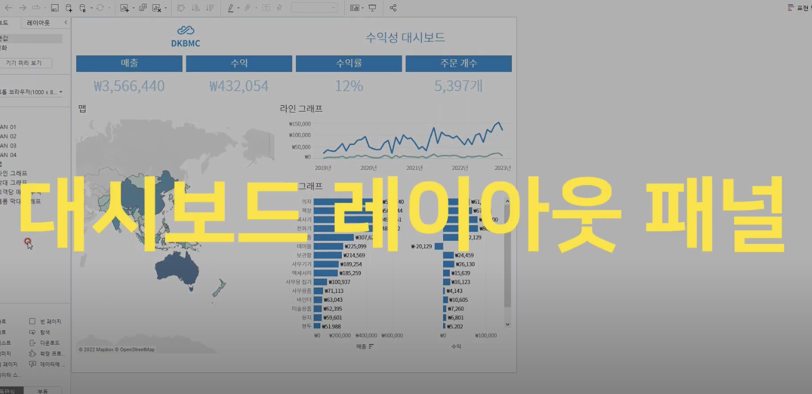
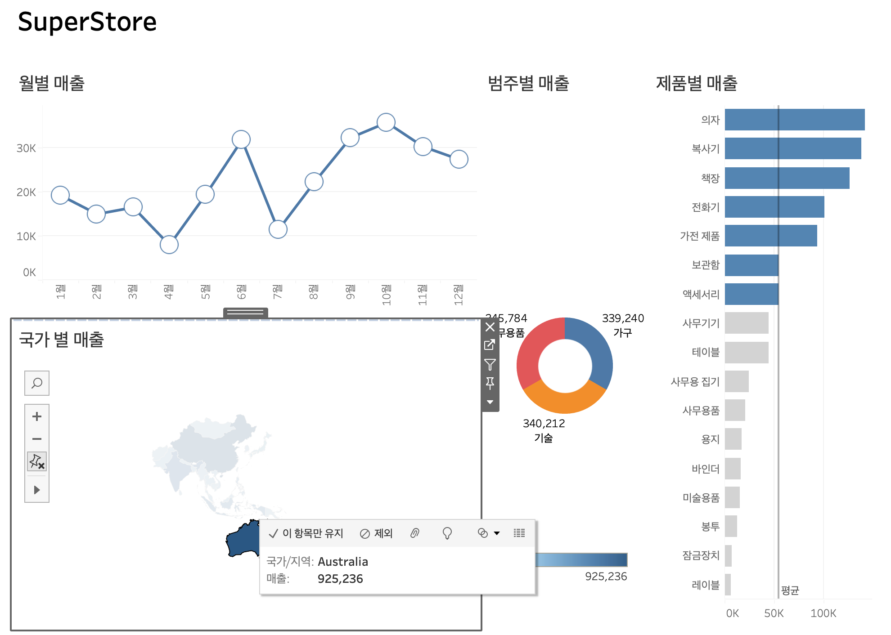

# Sixth Study Week

## Study Schedule

 

| 회차 | 강의 범위 | 강의 이수 여부 | 링크                                                                                                 |
| ---- | --------- | -------------- | ---------------------------------------------------------------------------------------------------- |
| 1    | 1~7강     | ✅             | [링크](https://www.youtube.com/watch?v=AXkaUrJs-Ko&list=PL87tgIIryGsa5vdz6MsaOEF8PK-YqK3fz&index=84) |
| 2    | 8~17강    | ✅             | [링크](https://www.youtube.com/watch?v=AXkaUrJs-Ko&list=PL87tgIIryGsa5vdz6MsaOEF8PK-YqK3fz&index=75) |
| 3    | 18~27강   | ✅             | [링크](https://www.youtube.com/watch?v=AXkaUrJs-Ko&list=PL87tgIIryGsa5vdz6MsaOEF8PK-YqK3fz&index=65) |
| 4    | 28~37강   | ✅             | [링크](https://www.youtube.com/watch?v=e6J0Ljd6h44&list=PL87tgIIryGsa5vdz6MsaOEF8PK-YqK3fz&index=55) |
| 5    | 38~47강   | ✅             | [링크](https://www.youtube.com/watch?v=AXkaUrJs-Ko&list=PL87tgIIryGsa5vdz6MsaOEF8PK-YqK3fz&index=45) |
| 6    | 48~57강   | ✅             | [링크](https://www.youtube.com/watch?v=AXkaUrJs-Ko&list=PL87tgIIryGsa5vdz6MsaOEF8PK-YqK3fz&index=35) |
| 7    | 58~67강   | 🍽️             | [링크](https://www.youtube.com/watch?v=AXkaUrJs-Ko&list=PL87tgIIryGsa5vdz6MsaOEF8PK-YqK3fz&index=25) |
| 8    | 68~77강   | 🍽️             | [링크](https://www.youtube.com/watch?v=AXkaUrJs-Ko&list=PL87tgIIryGsa5vdz6MsaOEF8PK-YqK3fz&index=15) |
| 9    | 78~85강   | 🍽️             | [링크](https://www.youtube.com/watch?v=AXkaUrJs-Ko&list=PL87tgIIryGsa5vdz6MsaOEF8PK-YqK3fz&index=5)  |

---

 
<!-- 여기까진 그대로 둬 주세요-->

> **🧞‍♀️ 오늘은 강의보다 실습과 대시보드 직접 만들기가 더 중요하니, 기록보다는 사고하며 강의를 들어주세요.**

이번주차는 정리보다 강의의 활용을 중점적으로 두어 정리를 크게 따로 진행하진 않았습니다

## 48. 워크시트 서식(2)

<!-- 워크시트에 관해 본 강의에서 알게 된 점을 적어주세요 -->

[48강](https://youtu.be/mfEodrj5I-4?list=PL87tgIIryGsa5vdz6MsaOEF8PK-YqK3fz)  

## 49강. 대시보드패널

<!-- 대시보드패널 강의에서 알게 된 점을 적어주세요. -->

[49강](https://youtu.be/NGMEskrsRfI?list=PL87tgIIryGsa5vdz6MsaOEF8PK-YqK3fz)  

## 50. 대시보드 구성방식

<!-- 알게 된 점을 적고, 아래 질문에 답해보세요 :) -->

[50강](https://youtu.be/wv2Zy6QcN-o?list=PL87tgIIryGsa5vdz6MsaOEF8PK-YqK3fz)  

> **🧞‍♀️ 부동과 바둑판식 방식을 차이를 중점으로 기술해보세요**

- 부동 레이아웃은 원하는 위치에 특정 요소를 배치하여 자유로운 디자인을 구현 가능하다.
  하지만 화면 크기가 달라질 경우 요소가 의도한 대로 안보일 수 있다

- 바둑식판 레이아웃은 화면 크기에 따라 각 셀의 크기가 자동으로 조절되어 다양한 기기에서 편리하지만, 레이아웃이 일관적이다.

## 51. 대시보드 컨테이너

[51강](https://youtu.be/6vwKuYVatp8?list=PL87tgIIryGsa5vdz6MsaOEF8PK-YqK3fz)  

## 52. 레이아웃 패널

[52강](https://youtu.be/q9rcKBWbdF8?list=PL87tgIIryGsa5vdz6MsaOEF8PK-YqK3fz)  

## 53. 필터 동작

[53강](https://youtu.be/UHu7Vq2JGXo?list=PL87tgIIryGsa5vdz6MsaOEF8PK-YqK3fz)  

<!-- 필터 동작에 대해 알게 된 점을 적어주세요 -->

## 54. 대시보드 하이라이터 동작

[54강](https://youtu.be/K8wocb9NBcI?list=PL87tgIIryGsa5vdz6MsaOEF8PK-YqK3fz)  

<!-- 하이라이터에 대해 알게 된 점을 적어주세요 -->

## 55. 대시보드 URL

[55강](https://youtu.be/_Qyx9asHwTw?list=PL87tgIIryGsa5vdz6MsaOEF8PK-YqK3fz)  

<!-- URL에 대해 알게 된 점을 적어주세요 -->

## 56. 대시보드 시트에 이동 동작

[56강](https://youtu.be/YUdEzpcMeyY?list=PL87tgIIryGsa5vdz6MsaOEF8PK-YqK3fz)  

<!-- 대시보드 시트에 이동에 대해 알게 된 점을 적어주세요!-->

## 57. 매개변수 변경 동작

[57강](https://youtu.be/sgqSFTRR9kU?list=PL87tgIIryGsa5vdz6MsaOEF8PK-YqK3fz)  

<!-- 매개변수 변경 동작에 대해 알게 된 점을 적어주세요!-->

## 문제

오늘은 별도의 문제가 없습니다.

여러 대시보드를 참고하시어, superstore 데이터를 사용해 나만의 대시보드를 제작해주세요.

**단, 워크시트 3개 이상의 그래프를 표시해야 하며 각 시트 간 상호작용성 필터 or 하이라이트 동작은 꼭 추가되어야 합니다**

어떤 부분에 가중을 두었는지, 어떤 사용자 편의성을 고려하였는지에 대한 설명이 필요합니다.

---

### 국가를 클릭하면 월별매출, 범주별 매출, 제품별 매출이 해당 국가에 맞게 변경됩니다.

 

